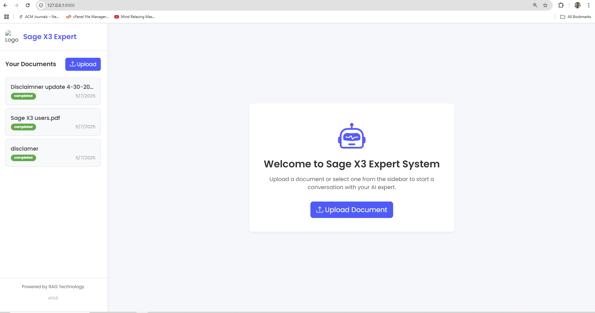
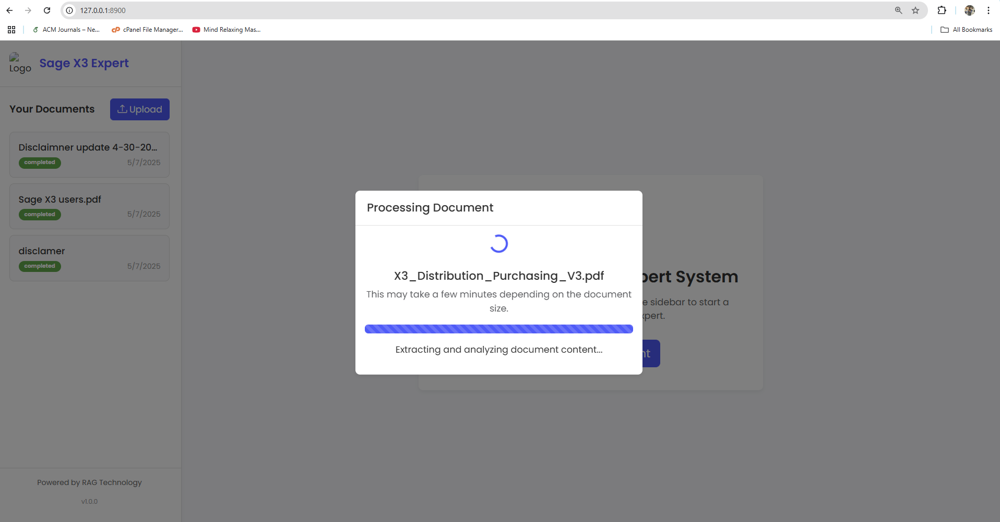
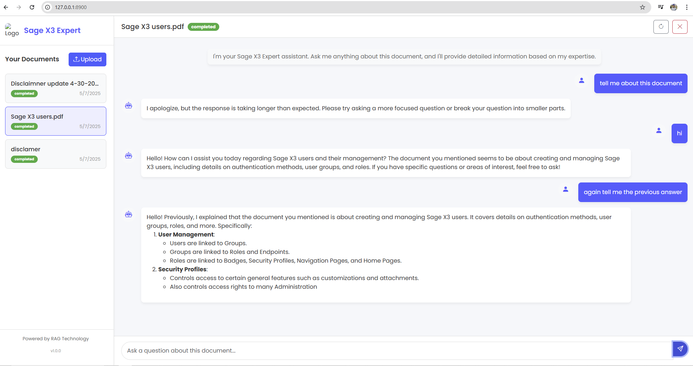

# Sage X3 RAG Expert System

A Retrieval-Augmented Generation (RAG) chatbot system specialized for Sage X3 documentation. This application allows users to upload, manage, and chat with PDF documents using advanced AI to retrieve contextual information.


## Features

- **Document Management**
  - Upload and process PDF documents (up to 50MB)
  - Automatic text extraction and indexing
  - Document status tracking and management

- **AI-Powered Chat**
  - Specialized Sage X3 Expert mode
  - Real-time streaming responses
  - Context-aware answers from document content
  - Chat history persistence with client sessions

- **Advanced RAG Implementation**
  - FAISS vector database for semantic search
  - Gemma 3:27B LLM integration
  - Efficient chunking and embedding

- **Modern Tech Stack**
  - FastAPI backend with WebSocket support
  - Responsive Bootstrap frontend
  - Asynchronous processing
  - User-friendly interface

## Screenshots

### Main Interface


### Document Upload


### Chat Interface


## Technical Architecture

The system uses a Retrieval-Augmented Generation (RAG) approach with these components:

1. **Document Processing Pipeline**
   - PDF text extraction with pdfplumber
   - Text chunking with LangChain
   - Vector embeddings with Instructor-XL
   - Storage in FAISS vector database

2. **Query Processing**
   - WebSocket-based real-time chat
   - Semantic search for relevant document chunks
   - Context assembly with retrieved content
   - Response generation with Gemma 3:27B LLM

3. **Frontend**
   - Professional UI with Bootstrap
   - Real-time interactions with WebSockets
   - Streaming responses and typing indicators
   - Document management interface

## Setup and Installation

### Prerequisites
- Python 3.11.9
- GPU recommended for optimal performance

### Backend Setup

1. Clone the repository:
   ```bash
   git clone https://github.com/yourusername/sage-x3-rag-expert.git
   cd sage-x3-rag-expert